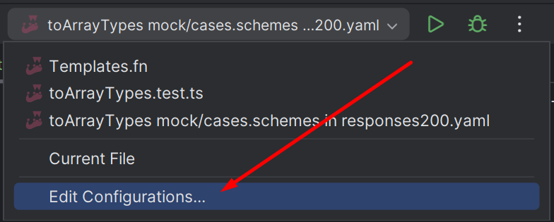
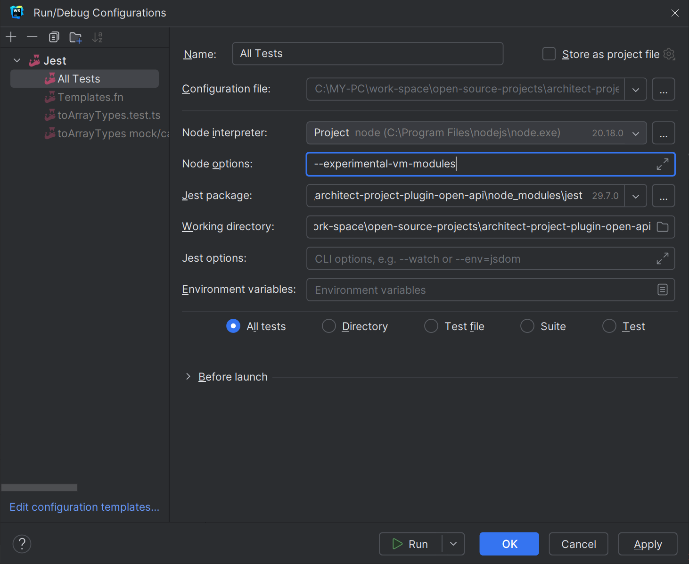

# Code generator for OpenAPI

# Tests 
Some tests use eslint for formating code before it will use in snapshots. Method for formating code placed: `src/__test__/utils/code.ts`.
For correct applying eslint must be met conditions:
1. Should be created temporary file: `temp/forEslintAutoFix.ts`
2. Jest starting with flag: `--experimental-vm-modules`
  > In Webstorm top panel: <br>
  > 
  > Edit configuration
  > 
  > In field "Node options:" `--experimental-vm-modules`
  > 

# Contributing

## Public new version

For publish new
1. Increment version in package.json 
2. Run command:
   ```shell
   npm publish
   ```
   It will run test → build → publish